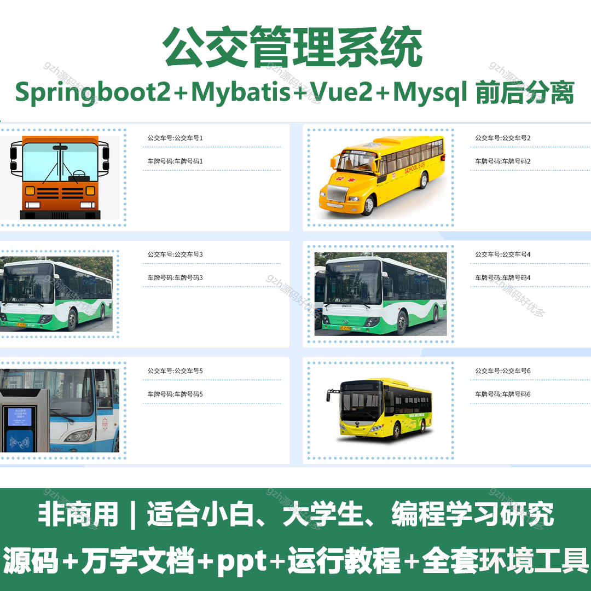
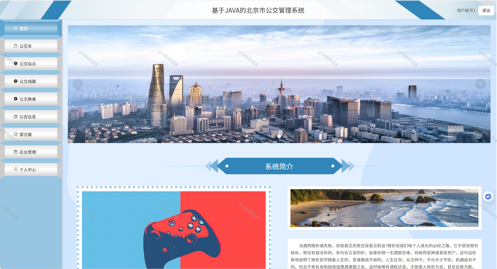
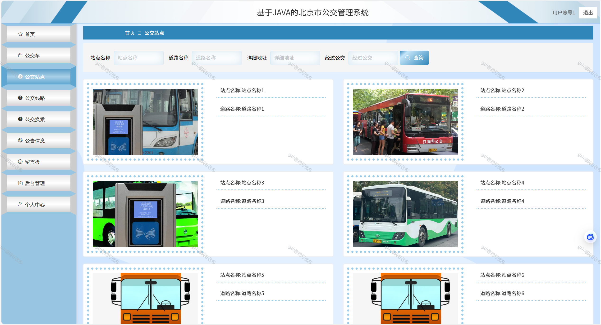
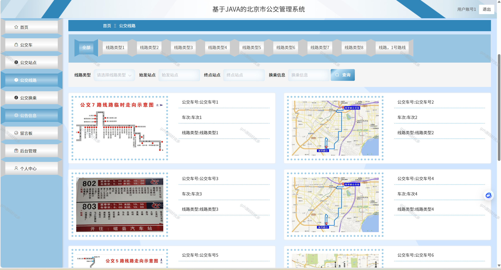
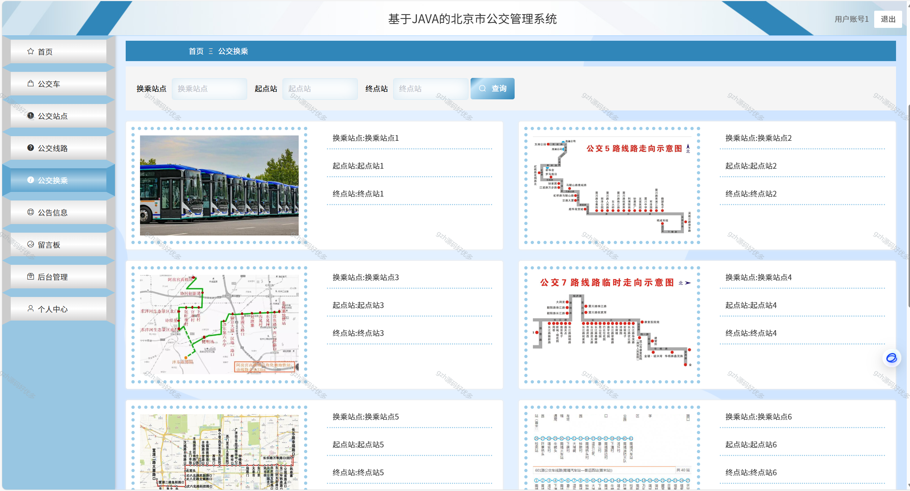
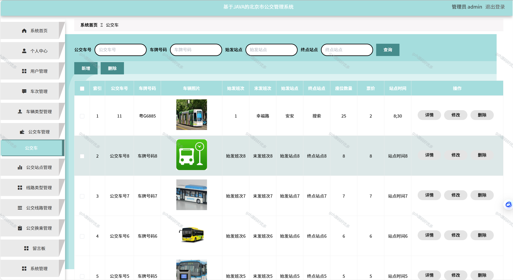
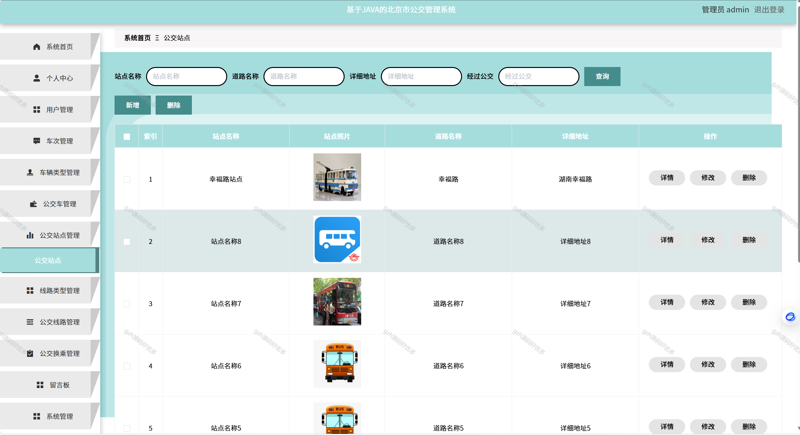
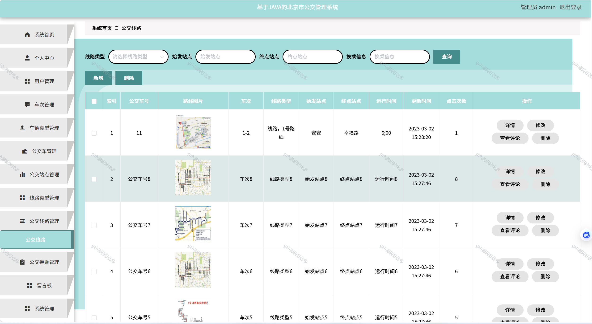
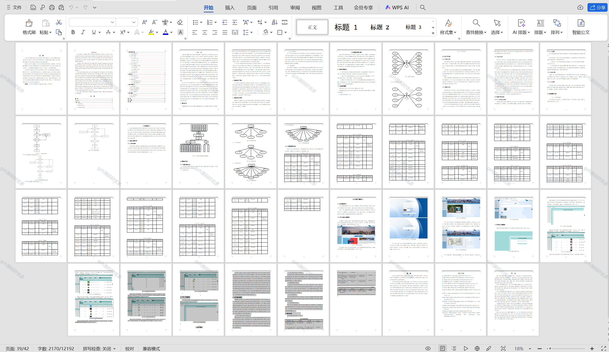

# springbootA240
springbootA240北京市公交管理系统+LW+PPT
 
## 查看主页获取源码

### 一、关键词
公共交通管理系统，公交运营管理系统，公交智能化管理系统

### 二、作品包含
源码+数据库+设计文档万字+全套环境和工具资源+本地部署教程

### 三、项目技术
前端技术：Html、Css、Js、Vue2.0、Element-ui 
后端技术：Java、SpringBoot2.0、MyBatis

### 四、运行环境（以下版本亲测，其他版本未知，请自测）
开发工具：IDEA/eclipse  + VSCODE

数据库：MySQL5.7（最低要5.7版本）

数据库管理工具：Navicat10以上版本

环境配置软件： JDK1.8 + Maven3.6.3

前端Nodejs：14

浏览器：谷歌浏览器

### 五、项目介绍
项目编号：springbootA240

北京市公交管理系统的目的是让使用者可以更方便的将人、设备和场景更立体的连接在一起。能让用户以更科幻的方式使用产品，体验高科技时代带给人们的方便，同时也能让用户体会到与以往常规产品不同的体验风格。
与安卓，iOS相比较起来，北京市公交管理系统在流畅性，续航能力，等方方面面都有着很大的优势。这就意味着北京市公交管理系统的设计可以比其他系统更为出色的能力，可以更高效的完成最新的公交车、公交站点、公交线路等功能

### 六、运行截图

